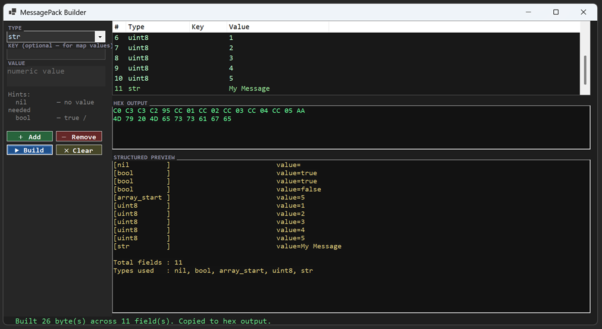

## MsgPackBuilder || Message Pack Message Builder

To make working with MessagePack easier.

Build Instructions:
1. If you don't have the .Net SDK installed, do that first. Get it [here](https://dotnet.microsoft.com/en-us/download/dotnet/10.0) or use a package manager like Chocolatey, Scoop, or Homebrew.
2. Open terminal and run the following:
```
git clone https://github.com/cjens00/MsgPackBuilder MsgPackBuilder
cd MsgPackBuilder
dotnet build
```

Usage:
1. Add any type from the dropdown box
2. (Map-type) Enter A Key
3. Enter a value for the type (for nil/null, leave blank)
4. Repeat until finished
5. Press the 'Build' button! 


